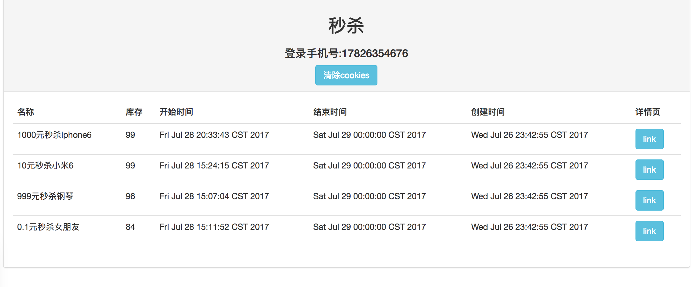
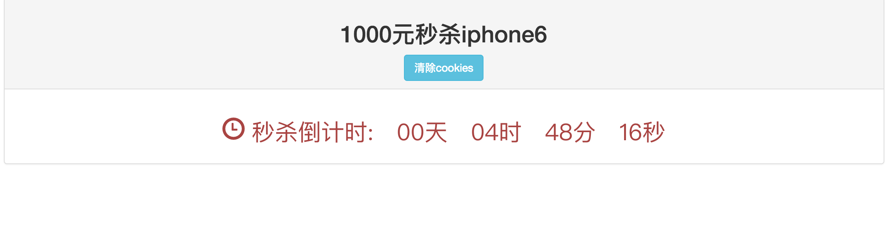
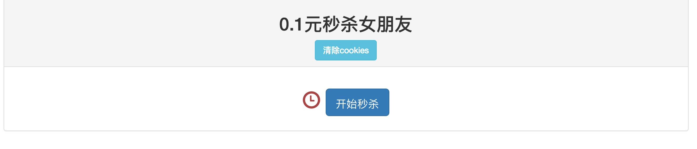

# seckill

用SpringBoot实现的秒杀案例

- Mybatis
- Mysql
- redis

数据库连接池使用hikari

优点：快速配置、运行简单快速

### 更新日志

*2018-6-11

- 更新springboot2.0
- 更新相关依赖
- 引入lombok
- 优化代码

## 项目环境

- JDK 1.8

- 项目使用Idea搭建

## 项目效果图

- 秒杀商品列表

- 商品详情页1

- 商品详情页2

## Getting Started

1. git clone https://github.com/monigo/seckill.git

2. idea打开项目 打开src/main/resources/application.yml

3. 使用sql文件夹下的sql文件初始化数据库

4. 配置mysql登录用户名和密码

5. Run！

